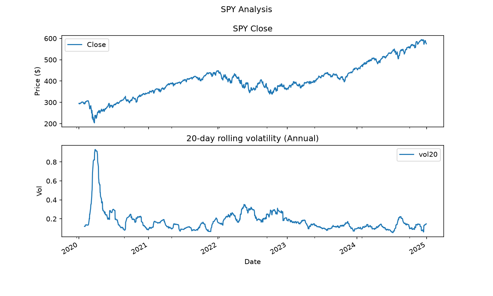
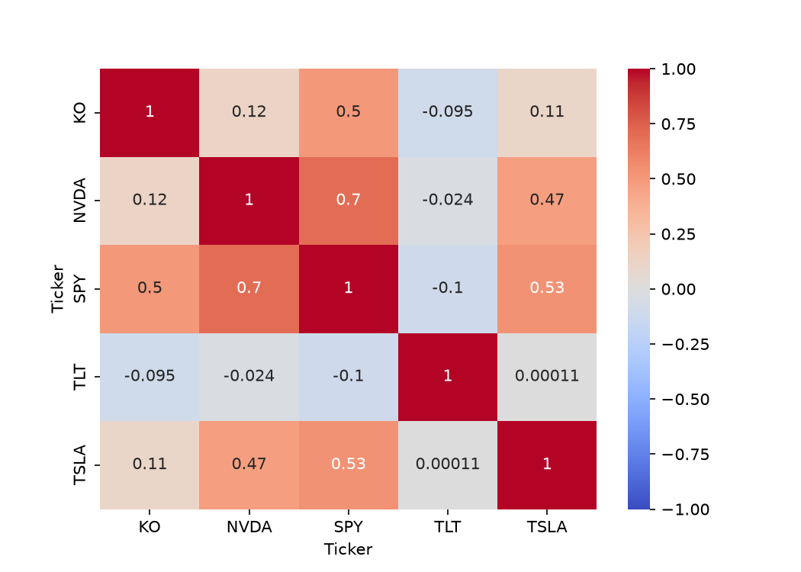
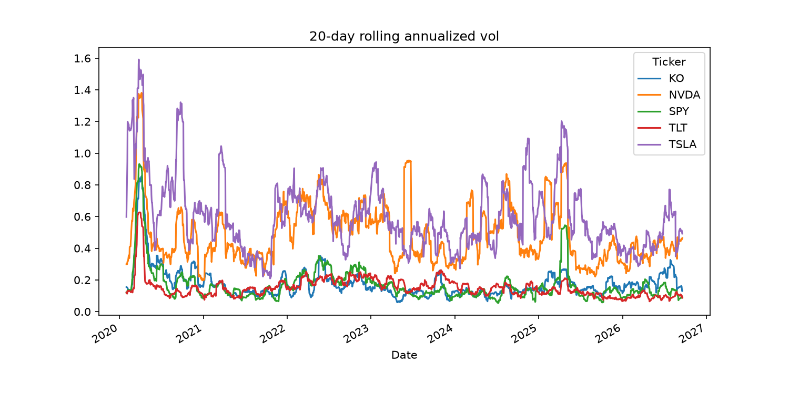

# market-analysis

Quantitative research on equity returns, volatility, and portfolio construction.
Python · pandas · numpy · matplotlib · seaborn · yfinance

Shared metric functions live in `src/metrics.py`; each project is a notebook in `notebooks/`.

**Data:** daily adjusted prices from Yahoo Finance, 2020-01-01 to present.
Results are specific to this window, which contains the COVID crash, a historic
bull run, and the 2022 bond bear market.

## Setup
```
pip install -r requirements.txt
jupyter notebook
```

## Project 1: return analysis on SPY


From this we can see that the returns centralize around 0 on the histogram.
From the tails we see that there are some days with +10% -10% returns too.

Furthermore, the closing price consistently goes up over the years. This was during a period of a historic bull run. The conclusion drawn from the data may change based on the time frame.

Spikes/dips in the vol are seem to be correlated with the close prices. Just eyeballing it seems at higher volatilities the close drops and at lower volatilities the close raises.


## Project 2: multi-stock analysis


TLT is the only genuine diversifier. From the heatmap we can see that it has a negative or nearly 0 corr with all the other stocks.
However, even though it diversifies the most it had a maxDD of -0.48 which is worse than the spy so it is also the most costly to hold.

All the stocks have a 0.5-0.7 corr meaning diversifying over these stocks gives less protection than appears. KO-TSLA and KO-NVDA are exceptions to this corr.

| Ticker   |   Ann. ret |   Ann. vol |   Sharpe |   MaxDD |   MaxDu |
|:---------|-----------:|-----------:|---------:|--------:|--------:|
| KO       |      0.106 |      0.202 |    0.601 |  -0.37  |   1.958 |
| NVDA     |      0.718 |      0.518 |    1.302 |  -0.663 |  47.2   |
| SPY      |      0.152 |      0.201 |    0.806 |  -0.337 |   2.805 |
| TLT      |     -0.047 |      0.165 |   -0.209 |  -0.484 |   0.269 |
| TSLA     |      0.462 |      0.647 |    0.91  |  -0.736 |  19.343 |

NVDA has the best sharpe but also the second worst drawdown. Both the metrics are important.   



Vol spikes are market wide. When covid hit they all spiked together
