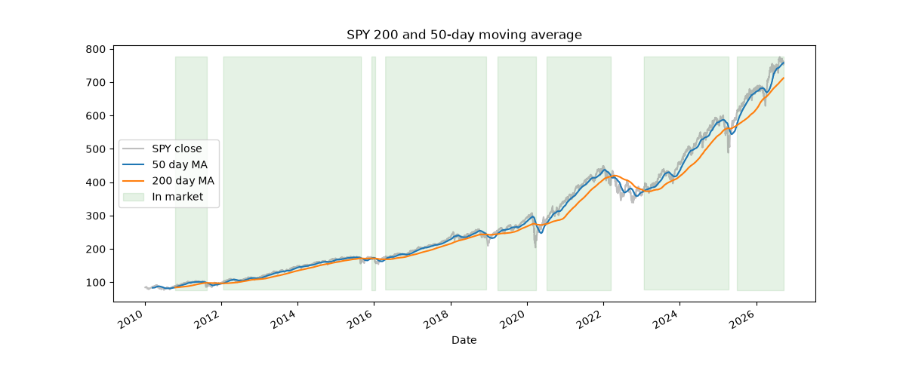
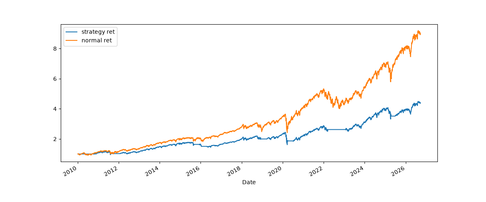
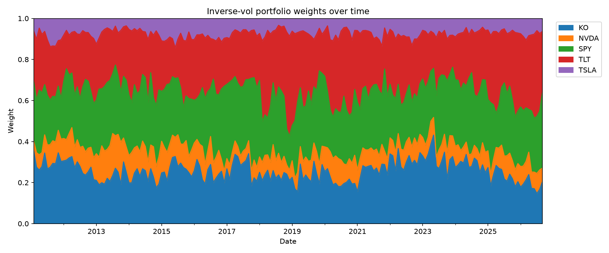

# market-analysis

Quantitative research on equity returns, volatility, and portfolio construction.
Python · pandas · numpy · matplotlib · seaborn · yfinance

Shared metric functions live in `src/metrics.py`; each project is a notebook in `notebooks/`.

**Data:** daily adjusted prices from Yahoo Finance, 2010–2011 onward depending on the project.
Results are specific to this window, which contains the COVID crash, a historic
bull run, and the 2022 bond bear market.

## Setup

```
pip install -r requirements.txt
jupyter notebook
```

## Project 1: return analysis on SPY


From this we can see that the returns centralize around 0 on the histogram.
From the tails we see that there are some days with +10% -10% returns too.

Furthermore, the closing price consistently goes up over the years. This was during a period of a historic bull run. The conclusion drawn from the data may change based on the time frame.

Spikes/dips in the vol are seem to be correlated with the close prices. Just eyeballing it seems at higher volatilities the close drops and at lower volatilities the close raises.

## Project 2: multi-stock analysis


TLT is the only genuine diversifier. From the heatmap we can see that it has a negative or nearly 0 corr with all the other stocks.
However, even though it diversifies the most it had a maxDD of -0.48 which is worse than the spy so it is also the most costly to hold.

All the stocks have a 0.5-0.7 corr with SPY meaning diversifying over these stocks gives less protection than appears. KO-TSLA and KO-NVDA are exceptions to this corr.

| Ticker | Ann. ret | Ann. vol | Sharpe |  MaxDD |  MaxDu |
| :----- | -------: | -------: | -----: | -----: | -----: |
| KO     |    0.106 |    0.202 |  0.601 |  -0.37 |  1.958 |
| NVDA   |    0.718 |    0.518 |  1.302 | -0.663 |   47.2 |
| SPY    |    0.152 |    0.201 |  0.806 | -0.337 |  2.805 |
| TLT    |   -0.047 |    0.165 | -0.209 | -0.484 |  0.269 |
| TSLA   |    0.462 |    0.647 |   0.91 | -0.736 | 19.343 |

NVDA has the best sharpe but also the second worst drawdown. Both the metrics are important.


Vol spikes are market wide. When covid hit they all spiked together

# Project 3: SPY 200 and 50-day moving average back testing



In this project I analyzed a 200 and 50 day moving average. This is a graph showing the moving averages versus the regular closing price. Anytime there is a "golden cross" where the 50-day crosses the 200-day upwards we buy. Everytime it crosses downwards, also known as the "death cross" we sell. Over the course of 16 years we only make 16 trades; 8 roundtrip trades.


| | Total ret | Ann. ret | Ann. Vol | Sharpe | MaxDD |
|:-----------------|------------:|-----------:|-----------:|---------:|----------:|
| Buy & hold | 8.02808 | 0.14106 | 0.170587 | 0.859247 | -0.337173 |
| Strategy (gross) | 3.41105 | 0.0930854 | 0.13949 | 0.708182 | -0.337173 |
| Strategy (net) | 3.37802 | 0.0925929 | 0.139498 | 0.704919 | -0.337173 |

Here we have a graph of the returns from trading using the strategy versus just holding and a table with some statistics. The cost of 0.05% per trade is negligible so I will just compare the gross and buy & hold rows.

We see that buying and holding results in a 14.1% return versus the strategy giving us 9.3%. The sharpe ratio of holding is also 0.85 versus 0.70. From these alone, we can conclude that buying and holding is the better strategy.

What's interesting is that MaxDD is identical for both. The 200-day average reacts too slowly for a 33-day crash: SPY peaked Feb 19 2020 and bottomed Mar 23, but the death cross didn't trigger until Mar 31, so the strategy exited on Apr 1 — nine days after the bottom. It held the full position through the entire decline, so its drawdown matches buy & hold exactly.

It then sat in cash through the recovery, missing +2.3% on Apr 2 and +6.7% on Apr 6. That is where the return gap comes from: 20% of days out of the market, and those days disproportionately contain rebounds.

So the strategy has lower volatility (14.0% vs 17.1%) but a worse risk-adjusted return (Sharpe 0.70 vs 0.86) and no drawdown protection at all. A 200-day lag can only help against slow, grinding declines; not fast crashes.

# Project 4: Inverse vol portfolio evaluation

In this project, I calculated inverse volatility for 5 stocks based on a 20 day window.

Then we calucated the sum of the inverse vol for those stocks in rows and divided the individual stock inv vol by that value to get a normalized value betweend 0 and 1. These are the "weights" we assign more money to the we assign more money to the less volatile stocks and less to the more volatile so that each stock contributes roughly equal risk. We can see how the weights moved from month to month in the graph below.


Avg daily turnover: 0.0361
Annual turnover: 9.1x
Monthly annual turnover: 1.8x
| | Total ret | Ann. ret | Ann. Vol | Sharpe | MaxDD |
|:----------------------|------------:|-----------:|-----------:|---------:|----------:|
| equal weight | 38.778 | 0.266405 | 0.20243 | 1.2685 | -0.361281 |
| inverse vol | 10.2203 | 0.167692 | 0.127793 | 1.27747 | -0.233871 |
| inv vol (net) | 9.45142 | 0.16239 | 0.127802 | 1.24175 | -0.236483 |
| inv vol monthly | 9.39271 | 0.16197 | 0.131863 | 1.20482 | -0.281648 |
| inv vol monthly (net) | 9.24512 | 0.160905 | 0.131864 | 1.19785 | -0.281648 |

From this chart, just looking at the values unadjusted for cost, we can see that the equal weight method had a higher return 38.8x versus 10.2x. It also had a higher annualized return, 26.6% vs 16.8%. The sharpe values were roughly the same meaning diversifying according the inv vol didn't improve the return to risk ratio. A notable difference was that the max drawdown dropped down to -0.23 for inv vol versus -0.36 for equal weight. This means that the worse loss was reduced significantly. Also the annual volatility for the inv vol was much lower 0.12 versus 0.20.

Rebalancing monthly cut turnover from 9.1× to 1.8× but performed worse, not better (Sharpe 1.198, MaxDD −28.2% vs −23.6% daily). Between rebalance dates the weights are frozen, so when volatility spikes the portfolio holds stale pre-spike weights for up to a month. During fast regime changes that lag costs more than the trading it saves.
